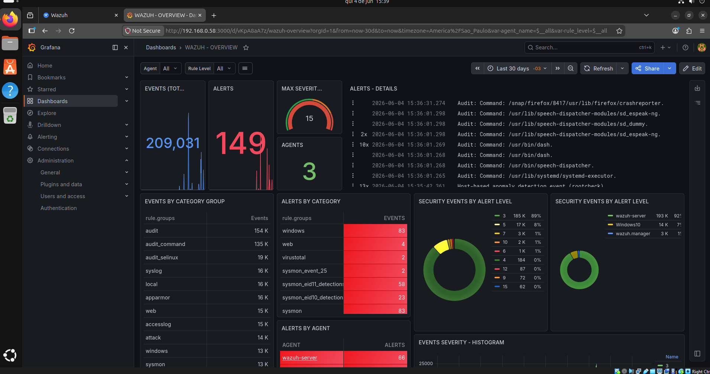
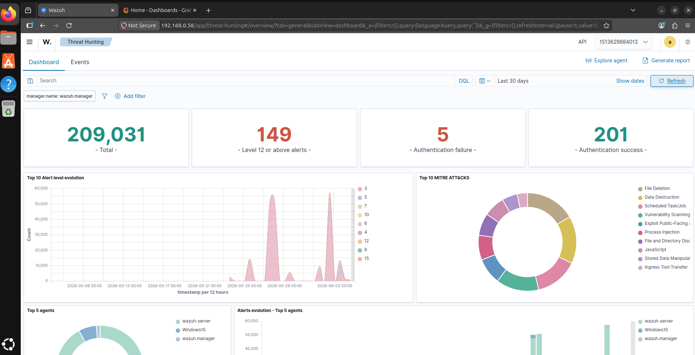
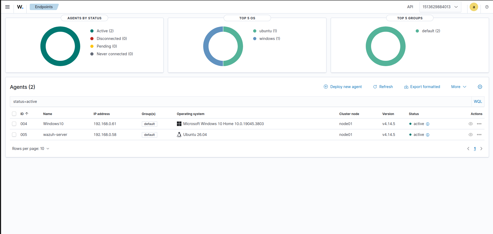
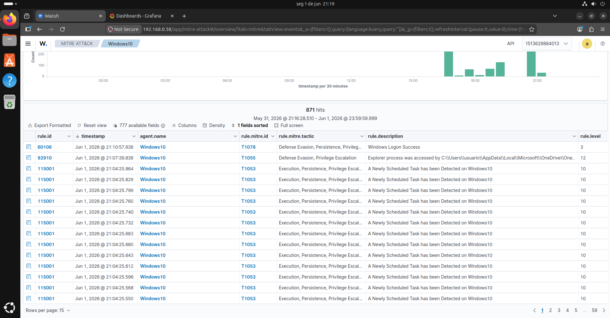
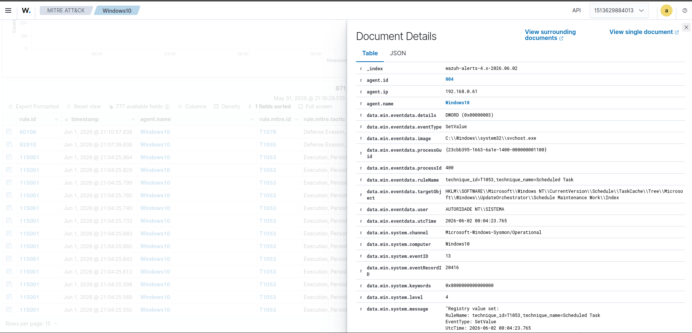
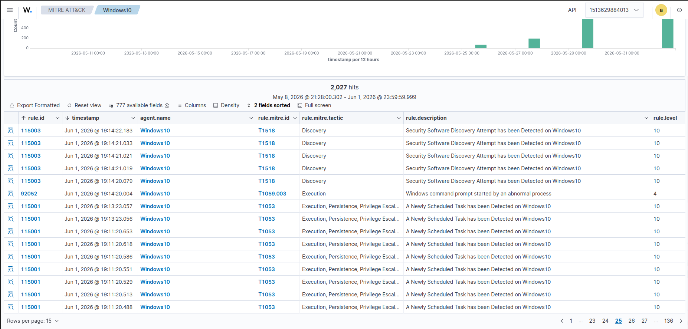
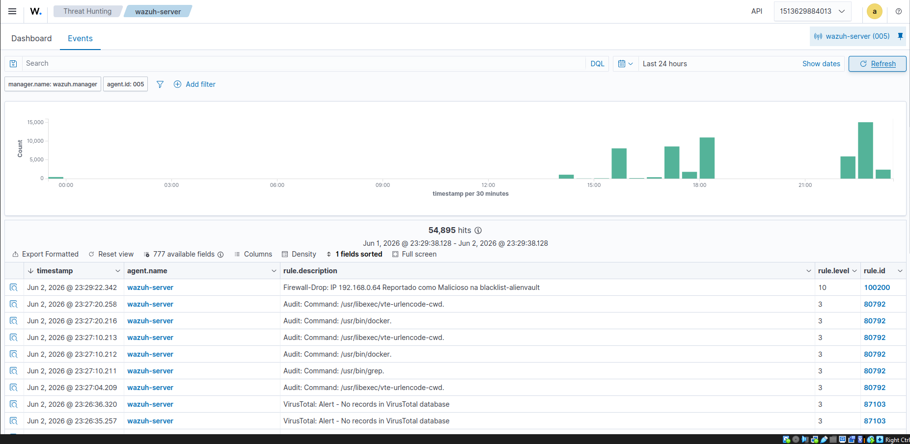
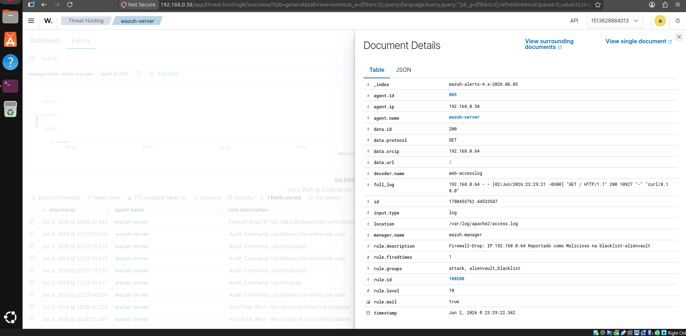
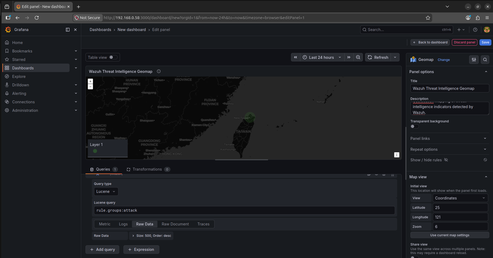
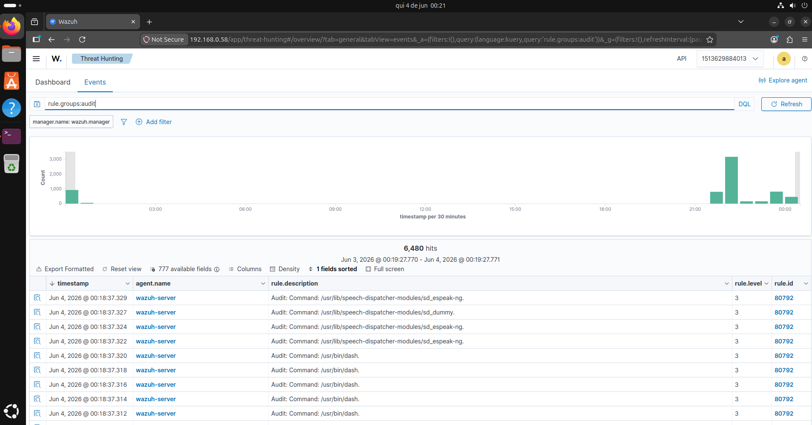

# Wazuh Blue Team Lab


> Blue Team laboratory focused on Detection Engineering, Threat Hunting, Threat Intelligence, Security Monitoring and Incident Investigation using Wazuh, Sysmon, Atomic Red Team, Grafana and AlienVault OTX.

---

# Overview

This project documents the deployment of a complete Security Operations Center (SOC) laboratory built around Wazuh SIEM.

The environment was designed to simulate real-world Blue Team operations including:

- Security Monitoring
- Detection Engineering
- Threat Hunting
- Threat Intelligence
- MITRE ATT&CK Validation
- Incident Investigation
- Dashboard Visualization
- IOC Correlation

---

# Lab Architecture

| Component | Purpose |
|------------|------------|
| Wazuh Manager | Central SIEM |
| Ubuntu Server | Hosts Wazuh stack |
| Windows 10 | Monitored Endpoint |
| Kali Linux | Attack Simulation Platform |
| Sysmon | Endpoint Telemetry |
| Atomic Red Team | ATT&CK Simulations |
| AlienVault OTX | Threat Intelligence Feed |
| Grafana | Security Dashboards |
| Docker | Container Management |
| Portainer | Docker Administration |

---

# SOC Monitoring Dashboard

Main security monitoring dashboard used to visualize events, alerts, agent activity, MITRE ATT&CK coverage and threat hunting data collected by the Wazuh SIEM platform.

The dashboard currently monitors more than 200,000 events and provides visibility into security alerts, agent activity and detection coverage across the lab environment.

Features displayed:

- Total Events
- Active Alerts
- Severity Distribution
- Agent Monitoring
- Event Categorization
- Security Analytics



---

# Threat Hunting Dashboard

Threat Hunting dashboard used to identify suspicious activity, analyze MITRE ATT&CK techniques and investigate security events across the environment.

Features:

- MITRE ATT&CK Visualization
- Alert Trend Analysis
- Security Event Correlation
- Top Attack Techniques
- Agent Activity Monitoring
- Threat Hunting Workflows
- Detection Coverage Analysis



---

# Active Agents

Windows and Linux systems monitored by Wazuh Agents.



---

# MITRE ATT&CK Validation

Atomic Red Team tests were executed and successfully mapped to MITRE ATT&CK techniques through custom Wazuh detection rules.



---

# Custom Detection Engineering

## Rule 115001 — Scheduled Task Detection

**MITRE ATT&CK:** T1053 - Scheduled Task

```xml
<rule id="115001" level="10">
  <if_group>windows</if_group>
  <field name="win.eventdata.ruleName" type="pcre2">
    technique_id=T1053,technique_name=Scheduled Task
  </field>
  <description>
    A Newly Scheduled Task has been Detected on $(win.system.computer)
  </description>
  <mitre>
    <id>T1053</id>
  </mitre>
</rule>
```

### Detection Example



---

## Rule 115003 — Security Software Discovery

**MITRE ATT&CK:** T1518 - Security Software Discovery

```xml
<rule id="115003" level="10">
  <if_group>windows</if_group>
  <field name="win.eventdata.ruleName" type="pcre2">
    technique_id=T1518.001,technique_name=Security Software Discovery
  </field>
  <description>
    Security Software Discovery Attempt has been Detected on $(win.system.computer)
  </description>
  <mitre>
    <id>T1518</id>
  </mitre>
</rule>
```

### Detection Example



---

# Threat Intelligence Integration

AlienVault OTX was integrated into Wazuh using custom scripts, CDB lists and correlation rules.

Capabilities include:

- IOC Feed Ingestion
- Threat Intelligence Correlation
- Malicious IP Detection
- Custom Blacklists
- Threat Hunting Validation
- Event Enrichment

---

## Rule 100200 — AlienVault Blacklist Detection

```xml
<group name="attack,">
  <rule id="100200" level="10">
    <if_group>web|attack|attacks</if_group>
    <list field="srcip" lookup="address_match_key">
      etc/lists/blacklist-alienvault
    </list>
    <description>
      Firewall-Drop: IP $(srcip) Reportado como Malicioso na blacklist-alienvault
    </description>
  </rule>
</group>
```

---

## Threat Intelligence Detection

Successful detection of an IOC imported from AlienVault OTX.



---

## Event Details

Detailed event generated by custom Rule 100200.



---

# Grafana Threat Intelligence Dashboard

Threat Intelligence events generated by Wazuh were integrated into Grafana dashboards for geographic visualization and IOC tracking.

Features:

- IOC Geolocation
- Geographic Threat Visualization
- Threat Hunting Dashboard
- Real-Time Event Monitoring
- Security Analytics
- Threat Intelligence Correlation

### Dashboard Example



---

# Threat Hunting Workflow

1. Event generated on endpoint
2. Wazuh Agent collects telemetry
3. Event forwarded to Wazuh Manager
4. IOC compared against AlienVault blacklist
5. Threat match identified
6. Correlation rule triggered
7. Alert generated
8. Threat investigation initiated

---


# Linux Auditd Monitoring

Auditd was integrated with Wazuh to provide Linux command execution visibility and support Threat Hunting activities on Linux systems.

The configuration monitors process execution events (`execve`) and forwards them to Wazuh for analysis and correlation.

Capabilities include:

- Linux Command Auditing
- Privileged Command Monitoring
- Process Execution Tracking
- Threat Hunting on Linux Endpoints
- Auditd Integration with Wazuh
- Security Event Correlation

## Audit Rules

```bash
-a always,exit -F arch=b64 -S execve -F auid=1000 -F egid!=994 -F auid!=-1 -F key=audit-wazuh-c

-a always,exit -F arch=b64 -S execve -F euid=0 -F auid>=1000 -F auid!=-1 -F key=audit-wazuh-c
```

## Audit Monitoring Example

The following example shows Linux command execution events collected by Auditd and successfully forwarded to Wazuh for monitoring and analysis.



---
# Skills Demonstrated

- Detection Engineering
- Threat Hunting
- Threat Intelligence
- Security Monitoring
- IOC Management
- Incident Investigation
- Wazuh Administration
- Sysmon Deployment
- MITRE ATT&CK Mapping
- Atomic Red Team
- Grafana Dashboard Creation
- Geospatial Threat Visualization
- Docker Administration
- Log Analysis
- Custom Rule Development
- CDB Lists
- SIEM Operations
- Linux Auditd Administration
---

# Future Improvements

- Active Response Automation
- Sigma Rule Integration
- Additional Threat Intelligence Sources
- Advanced Linux Threat Hunting Scenarios
- Multi-Endpoint Environment
- Advanced Grafana Dashboards
- SOAR Integrations

---

# Author

**Angelo Morozini**

Cybersecurity Student focused on:

- Blue Team Operations
- Detection Engineering
- Threat Hunting
- Threat Intelligence
- Security Monitoring

LinkedIn:
https://www.linkedin.com/in/angelo-morozini
